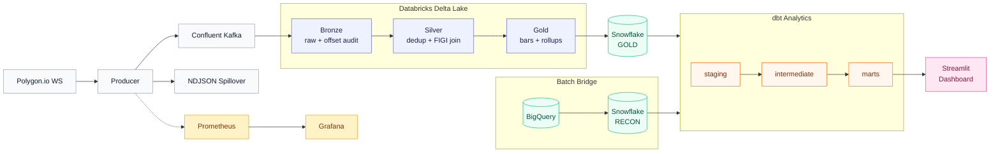

# Streaming Market Data Platform

End-to-end market data platform with real-time ingest and micro-batch processing: Polygon.io WebSocket &rarr; Kafka &rarr; Spark Structured Streaming &rarr; Delta Lake medallion (Bronze/Silver/Gold) &rarr; Snowflake, capturing **~80M+ events across 104 symbols over three consecutive trading sessions** with 100% delivery reliability. A dbt reconciliation and analytics layer compares streaming OHLCV against batch BigQuery ground truth, live-prices TTM fundamental ratios, and surfaces microstructure, risk, and anomaly signals through an 8-page Streamlit dashboard.

**[Live Dashboard](./dashboard/README.md)** &mdash; deployed via Streamlit Community Cloud

| | |
|---|---|
| **~80M+ events ingested** across three consecutive sessions &mdash; trades, NBBO quotes, and minute bars | **100% delivery reliability across all 3 sessions** &mdash; zero Kafka failures, zero spillover, zero WebSocket reconnects |
| **100% sync fidelity** &mdash; Delta &harr; Snowflake row counts identical across all Gold tables | **~50&times; bulk-load speedup** &mdash; `PUT + COPY INTO` vs `executemany` on the 7.4M-row trades table |

## Architecture



### Operating Snapshot

*Measured across three consecutive regular-hours sessions (2026-05-27, 05-28, 05-29).*

| Metric | Value |
|---|---|
| Symbols tracked | 104 (S&P 100 + TSLA + SPY / QQQ / IWM / DIA) |
| Real-time channels | AM (minute aggs, 104) &middot; T (trades, 104) &middot; Q (NBBO quotes, 20 high-liquidity) |
| Sessions captured | 3 full sessions, 6.5 hours each, regular market hours |
| Producer reliability (across all sessions) | `kafka_failed=0` &middot; `spillover=0` &middot; `reconnects=0` |
| Session 1 (2026-05-27) events &rarr; Kafka | 36,860,531 |
| Session 2 (2026-05-28) events &rarr; Kafka | full session, same reliability metrics |
| Session 3 (2026-05-29) events &rarr; Kafka | 42,015,098 |
| Kafka &rarr; Bronze drift | 0.002% (session-start checkpoint overlap; deduplicated downstream) |
| Sustained throughput (session 1) | ~1,580 events/sec average &middot; ~4,500 events/sec at open |
| Trades captured (session 1) | 18,523,949 (~178K per symbol) |
| NBBO quote updates (session 1) | 18,293,494 (~915K per quoted symbol) |
| Minute aggregate bars (session 1) | 43,802 (104 symbols &times; ~390 minutes &asymp; 100% coverage) |
| Symbol coverage in Silver | 103/104 (one symbol didn't trade on day 1) |
| FIGI match rate | 104/104 after historical security master integration |
| Snowflake sync match | 100% (Delta &harr; Snowflake row counts identical) |
| Average quoted spread (session 1) | 3.13 bps &middot; tightest minute 0.10 bps |
| dbt models | 30 (staging 9 &middot; intermediate 5 &middot; marts 16) |

### Data Flow

| Channel | Symbols | Cadence | Session Volume |
|---|---|---|---|
| AM (minute aggregates) | 104 | Every minute during market hours | 43,802 bars |
| T (trades) | 104 | Tick-level | 18.5M events |
| Q (NBBO quotes) | 20 high-liquidity | Tick-level | 18.3M events &rarr; ~1,000&times; reduction via pre-aggregated stats |

### Medallion Layers

| Layer | Purpose | Write Pattern |
|---|---|---|
| **Bronze** | Raw Kafka payloads, append-only, offset audit trail | Append with checkpoint |
| **Silver** | Typed, deduplicated, enriched with `composite_figi` identity | MERGE with event-specific dedup keys |
| **Gold** | Serving-ready bars, daily rollups, trade/quote aggregates | MERGE; daily rollup re-aggregated from full Silver snapshot |

## Engineering Design

### Exactly-Once Delivery

Streaming exactly-once is coordinated across three layers: Spark checkpoints commit Kafka offsets atomically with each Delta write, Silver MERGE operations use event-specific deduplication keys (`symbol, window_start` for aggregates; `trade_id` for trades; `symbol, timestamp, sequence` for quotes), and a `ROW_NUMBER() OVER (PARTITION BY key ORDER BY ingest_timestamp DESC)` dedup pass within each micro-batch eliminates duplicates from producer retries before the MERGE executes.

### Producer Durability

The producer is configured for Kafka idempotent delivery (`acks=all`, `enable.idempotence=true`, LZ4 compression) with automatic failover: when Kafka is unreachable, events spill to date-partitioned NDJSON files with a disconnect/reconnect gap log. A replay script re-publishes undelivered envelopes through the same code path on recovery, maintaining the exactly-once guarantee end-to-end.

### Late-Arriving Data

Gold `foreachBatch` re-aggregates each affected date from the full Silver snapshot using `min_by` / `max_by` over `window_start`. Late-arriving corrections are deterministic &mdash; the daily rollup always reflects the complete Silver state, not an incremental accumulation that can drift.

### Identity Resolution

`composite_figi` from the batch pipeline's SCD2 security master is the join key downstream of Silver. A daily Parquet seed is broadcast-joined during Silver enrichment, ensuring reconciliation and live-priced valuation survive ticker renames (FB &rarr; META) without code changes.

### Snowflake Sync

Gold Delta tables are synced to Snowflake using auto-routing based on table size. The initial implementation used `cursor.executemany()` with native Python `datetime` objects to work around an Arrow `int64` micros bug that caused Snowflake to reject `TIMESTAMP_NTZ` columns via `write_pandas`. For tables exceeding 50K rows, a `PUT` &rarr; `COPY INTO` bulk-load path with `MATCH_BY_COLUMN_NAME` achieves ~50&times; speedup (the 7.4M-row trades table loads in seconds vs. 12+ minutes via `executemany`).

### Streaming vs. Batch Reconciliation

The dbt mart joins streaming Gold daily rollups against batch BigQuery prices on `(composite_figi, date)`, producing close and VWAP deltas with a `recon_status` taxonomy (`OK`, `CLOSE_MISMATCH`, `VWAP_MISMATCH`, `PARTIAL_SESSION`, `MISSING_STREAMING`, `MISSING_BATCH`) that distinguishes genuine data quality issues from structurally expected divergence.

**Regular-session close pinning.** The streaming and batch closes come from *independent* sources: streaming's close is the last regular-session minute-bar print (≈16:00 continuous trade); batch's is the official consolidated/closing-auction price. The producer captures a few post-16:00 ET bars (sessions bleed to ~16:04), so `GOLD_DAILY_ROLLUP.close` — the last bar of the day — is frequently a post-market print ~5–9 bps off the official close. For a single day that error is small, but a **day-over-day return divides two closes, so the skew pollutes both the day it occurs on and the next day's return — it carries over**. The reconciliation layer therefore pins the streaming close to the last bar inside 09:30–16:00 ET (`int_streaming__session_close`) before computing returns and close deltas, so the comparison against the batch official close is like-for-like.

**Returns tolerance (50 bps).** Because the two close sources differ by a few bps per day and a return compounds that across both days, the returns recon flags `RETURN_MISMATCH` only above **50 bps** (`|streaming_return − batch_return| > 5e-3`). A tighter 5 bps threshold sat right on the median cross-source difference (~4 bps) and flagged roughly half the universe on structural noise rather than real error; 50 bps isolates genuine per-symbol divergences (e.g. a thin last-minute print or a large auction move) from that expected source-to-source noise.

### Live-Priced Valuation

TTM fundamentals (P/E, P/B, P/S, P/FCF, market cap) are computed in the batch pipeline. The streaming dbt layer rescales price-derived ratios by `live_close / batch_close` while passing through profitability and balance-sheet ratios unchanged. A `pricing_status` flag (`OK`, `STALE_STREAMING`, `MISSING_STREAMING`) distinguishes fresh prices from stale ones.

## Performance

### Per-Batch Processing Latency

Spark micro-batch durations from `OPS.PIPELINE_BATCH_METRICS`:

| Layer | Batches | p50 | p95 | p99 | Rows |
|---|---|---|---|---|---|
| Bronze | &mdash; | &mdash; | &mdash; | &mdash; | 36.9M |
| Silver | &mdash; | &mdash; | &mdash; | &mdash; | &mdash; |
| Gold | &mdash; | &mdash; | &mdash; | &mdash; | &mdash; |

*Per-batch latency numbers will be populated from the next `PIPELINE_BATCH_METRICS` query.*

### End-to-End Latency

With `trigger(availableNow=True)` on Databricks Serverless, observed end-to-end wall-clock latency (event time &rarr; Silver write) is dominated by trigger cadence, not processing time. The ~99-min p50 observed on 2025-05-27 decomposes as: 60s aggregation window + feed propagation + `availableNow` trigger interval (~5&ndash;10 min) + seconds of actual Spark processing.

On a Classic cluster with `trigger(processingTime="1s")`, the architectural ceiling is ~3&ndash;5s end-to-end. Switching modes is a single Databricks widget parameter &mdash; no code change. The `availableNow` / Serverless choice trades latency for roughly 10&times; cost savings.

## Reconciliation Accuracy

Streaming vs. batch reconciliation is computed nightly after bridging BigQuery daily prices to Snowflake and running `dbt run`.

| Metric | Value |
|---|---|
| Recon OK rate | &mdash; |
| Median \|&Delta;close\| (bps) | &mdash; |
| Returns mismatch rate | &mdash; |

*Recon metrics will be populated after the first batch bridge + dbt run cycle.*

## Dashboard

Eight-page Streamlit application reading from the Snowflake `MARKET_STREAMING` warehouse with 5-minute query caching.

| Page | What it shows |
|---|---|
| **Pipeline Health** | Batch metrics, per-layer latency, throughput, error rates |
| **Market Overview** | Daily stats, VWAP deviation, unusual activity flags |
| **Risk Analytics** | 20-day rolling beta, alpha, Sharpe ratio vs SPY, correlation heatmaps |
| **Data Quality** | Recon status distribution, quality scores, anomaly flags |
| **Microstructure** | Trade flow, bid-ask imbalance, trade intensity |
| **Fundamentals** | Live-priced P/E, P/B, P/S, dividend yields |
| **Dividends** | Dividend calendar, ex-dates, live yield estimates |
| **Reconciliation** | Streaming vs. batch close/VWAP deltas with status breakdown |

## Observability

The producer exposes Prometheus counters, gauges, and histograms on port 9090 (events received, Kafka delivery success/failure, produce latency). A Docker Compose stack runs Prometheus (5s scrape interval) and Grafana with a pre-provisioned producer dashboard. Slack webhook alerts fire on WebSocket reconnects, Kafka delivery failures, quality score drops, and reconciliation mismatches.

Pipeline batch-level metrics (rows in/out, duration, status per layer) are written to a Delta table synced to `OPS.PIPELINE_BATCH_METRICS`, surfaced through the dbt observability marts.

## dbt Models

30 models across four layers:

```
warehouse/models/
├── staging/               source renaming + type casting
│   ├── stg_streaming__*   Gold minute bars, daily rollup, trades, quote stats
│   └── stg_batch__*       daily prices, returns, fundamentals, dividends, company overview
│
├── intermediate/          alignment + enrichment
│   ├── int_recon__daily_aligned           streaming vs batch daily price alignment
│   ├── int_fundamentals__live_priced      TTM metrics rescaled with live close
│   ├── int_analytics__minute_returns      intra-minute return calculations
│   ├── int_analytics__daily_returns       daily return + rolling volatility
│   └── int_microstructure__trade_flow     trade size + direction analysis
│
└── marts/
    ├── recon/
    │   ├── mart_recon__daily_delta              close + VWAP deltas with recon_status
    │   └── mart_recon__returns_delta            streaming vs batch daily return comparison
    ├── analytics/
    │   ├── mart_analytics__daily_stats          realized vol, dollar volume, VWAP deviation
    │   ├── mart_analytics__rolling_risk         beta, alpha, Sharpe vs SPY (20-day)
    │   ├── mart_analytics__unusual_activity     z-score anomaly flagging
    │   ├── mart_analytics__correlation_matrix   pairwise return correlations
    │   ├── mart_analytics__volume_profile       intraday volume by 30-min bucket
    │   ├── mart_analytics__microstructure_daily trade intensity, avg size, bid-ask imbalance
    │   ├── mart_analytics__spread_profile       intraday bid-ask U-curve
    │   └── mart_analytics__trade_size_distribution
    ├── observability/
    │   ├── mart_ops__pipeline_health            batch metrics per layer
    │   └── mart_ops__data_quality               quality scores per symbol-date
    └── fundamentals/
        ├── mart_fundamentals__valuation_live    P/E re-priced with live close
        ├── mart_fundamentals__factor_scores     value/growth/quality enriched with sector
        └── mart_fundamentals__dividend_yield    live yield estimate with next ex-date
```

## Snowflake Schema

```
MARKET_STREAMING
├── GOLD                                synced from Databricks Delta
│   ├── GOLD_MINUTE_BARS                PK (composite_figi, window_start)
│   ├── GOLD_DAILY_ROLLUP               PK (composite_figi, event_date)
│   ├── GOLD_TRADES                     PK (composite_figi, trade_id)
│   └── GOLD_QUOTE_STATS               PK (composite_figi, window_start)
├── RECON                               bridged from BigQuery batch pipeline
│   ├── BATCH_DAILY_PRICES              split-adjusted OHLCV
│   ├── BATCH_DAILY_RETURNS             returns + 20/60-day rolling vol
│   ├── COMPANY_OVERVIEW                sector, market cap
│   ├── FUNDAMENTALS_VALUATION          TTM P/E, P/B, margins
│   ├── FUNDAMENTALS_FACTOR_SCORES      value/growth/quality scores
│   └── DIVIDEND_YIELD                  ex-dates + TTM yield
└── OPS                                 pipeline observability
    └── PIPELINE_BATCH_METRICS          rows in/out, duration, status per layer
```

## Quick Start

### Prerequisites

- Python 3.11+
- Polygon.io API key (WebSocket access)
- Confluent Cloud Kafka cluster
- Databricks workspace with Unity Catalog
- Snowflake account
- BigQuery access (for batch bridge + security master seed)

### Install

```bash
git clone https://github.com/athapar/market-streaming-platform.git
cd market-streaming-platform

# Core + producer dependencies
pip install -e ".[producer]"

# Reconciliation + dbt
pip install -e ".[recon]"

# Dashboard
pip install -e ".[dashboard]"

# All extras
pip install -e ".[producer,recon,dashboard,dev]"
```

### Configure

```bash
cp .env.example .env
# Fill in: POLYGON_API_KEY, KAFKA_*, SNOWFLAKE_*, GOOGLE_CLOUD_PROJECT, BQ_DATASET_ID
```

### Run

```bash
# 1. Seed the security master (BigQuery SCD2 → local Parquet)
python -m market_streaming.seed_security_master

# 2. Start the producer (market hours)
python -m market_streaming.producer.main          # live
python -m market_streaming.producer.main --dry-run # skip Kafka, count events only

# 3. Run streaming layers in Databricks (or use the orchestrator notebook)
#    bronze_ingest → silver_ingest (AM / trades / quotes)
#                  → gold_ingest   (AM / trades / quotes)
#                  → snowflake_sync

# 4. Bridge batch data after market close
python scripts/bq_to_snowflake_batch.py --date YYYY-MM-DD
python scripts/bq_to_snowflake_returns.py
python scripts/bq_to_snowflake_fundamentals.py   # quarterly
python scripts/bq_to_snowflake_dividends.py      # after ex-div events

# 5. Build dbt models
cd warehouse && dbt run && dbt test

# 6. Launch dashboard
streamlit run dashboard/Home.py
```

### Monitoring

```bash
cd monitoring
docker compose up -d   # Prometheus + Grafana on localhost:3000
```

## Tests & CI

46 unit tests covering config loading, envelope routing, spillover persistence, Slack alerting, and all three transform layers (bronze, silver, gold).

```bash
pytest tests/ -v
ruff check src/ tests/
```

CI runs on every push and PR against `main`: pytest across Python 3.11/3.12, ruff linting, and dbt project compilation.

## Repository Structure

```
src/market_streaming/
├── producer/              WebSocket client, Kafka sink, NDJSON spillover, metrics
├── bronze/transforms      Kafka → raw Delta (append-only, offset audit)
├── silver/transforms      parse, dedup, FIGI join, MERGE (AM, trades, quotes)
├── gold/transforms        minute bars, daily rollup, trade + quote aggregates
├── sync/snowflake_writer  Gold Delta → Snowflake (executemany / COPY INTO)
├── observability/         Slack alerts, batch-level pipeline metrics
└── seed_security_master   BigQuery SCD2 → local Parquet FIGI seed

notebooks/                 Databricks notebooks (bronze → silver → gold → sync)
scripts/                   Batch bridge, quality checks, topic provisioning, replay
warehouse/                 dbt project (30 models: staging → intermediate → marts)
dashboard/                 Streamlit app (8 pages over Snowflake)
dags/                      Airflow DAG for the EOD chain (see dags/README.md)
workflows/                 Databricks Workflow YAML for the intraday streaming layer
monitoring/                Prometheus + Grafana Docker Compose stack
tests/                     46 unit tests
```

## Orchestration

| Layer | Scheduler | Cadence |
|---|---|---|
| Producer (Kafka WebSocket) | Windows Task Scheduler | Start 09:25 ET, stop 16:05 ET, weekdays |
| Bronze → Silver → Gold → Snowflake sync | Databricks Workflows ([`workflows/pipeline_workflow.yml`](./workflows/pipeline_workflow.yml)) | Every 30 min, 09:30–16:30 ET |
| EOD: BQ bridge → dbt build | Airflow DAG ([`dags/eod_pipeline.py`](./dags/eod_pipeline.py)) — local equivalent in `scripts/run_eod.ps1` | 18:00 ET, weekdays |

The Airflow DAG models the cross-pipeline dependency explicitly: a BigQuery sensor waits for the companion batch pipeline to publish today's row before the bridge fires, replacing the implicit time-buffer pattern. See [`dags/README.md`](./dags/README.md) for deployment options.

## Tech Stack

`Python 3.11` &middot; `Polygon.io WebSocket` &middot; `Confluent Kafka` &middot; `Apache Spark Structured Streaming` &middot; `Databricks (Unity Catalog)` &middot; `Delta Lake` &middot; `Snowflake` &middot; `dbt` &middot; `BigQuery` &middot; `Apache Airflow` &middot; `Streamlit` &middot; `Plotly` &middot; `Prometheus` &middot; `Grafana` &middot; `Docker Compose` &middot; `GitHub Actions`

## Batch Pipeline Integration

This platform extends a [companion batch pipeline](https://github.com/athapar/financial-data-pipeline-project), bridging four classes of batch output into the streaming warehouse:

| Batch Output (BigQuery) | Bridged to Snowflake | Used by |
|---|---|---|
| `int_security_master_scd2` | Local Parquet seed | Silver FIGI broadcast join |
| `fct_daily_ohlcv` | `RECON.BATCH_DAILY_PRICES` | `mart_recon__daily_delta` |
| `mart_fundamentals_valuation` / `factor_scores` / `stg_company_overview` | `RECON.FUNDAMENTALS_*` / `COMPANY_OVERVIEW` | `mart_fundamentals__valuation_live`, `__factor_scores` |
| `mart_daily_returns` | `RECON.BATCH_DAILY_RETURNS` | `mart_recon__returns_delta` |
| `mart_dividend_yield` | `RECON.DIVIDEND_YIELD` | `mart_fundamentals__dividend_yield` |

`composite_figi` is the cross-pipeline identity key throughout, so reconciliation and live-priced valuation survive ticker renames without code changes.
