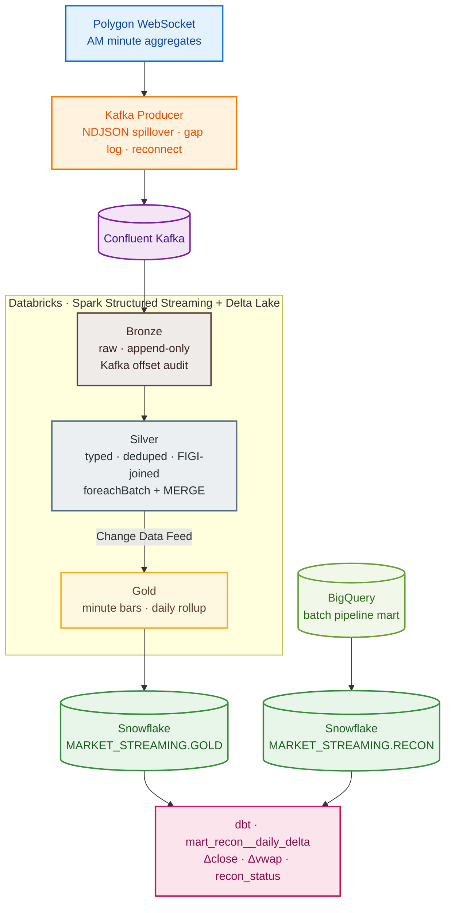

# Market Streaming Pipeline

End-to-end real-time market data lakehouse: **Polygon.io WebSocket → Kafka → Spark Structured Streaming → Delta Lake medallion → Snowflake**, with dbt reconciliation against a [companion batch pipeline](https://github.com/athapar/financial-data-pipeline-project). Designed for exactly-once delivery, idempotent writes, and a clean audit trail from raw event to analytical table.

## Architecture



## Tech Stack

`Python 3.11` · `Polygon.io WebSocket` · `Confluent Kafka` · `Apache Spark Structured Streaming` · `Databricks` · `Delta Lake (Unity Catalog)` · `Snowflake` · `dbt` · `BigQuery` (batch bridge)

## Engineering Highlights

| Problem | Solution |
|---|---|
| **Exactly-once across Kafka and Delta** | Spark checkpoints commit Kafka offsets atomically with each Delta write; downstream MERGE absorbs any replay from the last committed offset. |
| **Within-batch duplicates from producer retries** | `ROW_NUMBER() OVER (PARTITION BY symbol, window_start ORDER BY ingest_timestamp DESC)` dedup *before* the Silver MERGE — no full table scan. |
| **Snowflake `TIMESTAMP_NTZ` rejected as `NUMBER(38,0)`** | Traced to Arrow staging Parquet as `int64` micros. Replaced `write_pandas` with `cursor.executemany()` on native `datetime` objects — bypassed Arrow entirely. |
| **Producer durability without a secondary broker** | Date-partitioned NDJSON spillover on Kafka failure + gap log (disconnect/reconnect with reason) + replay script that re-publishes through the same code path. |
| **Late-arriving bars distorting daily rollup** | Gold `foreachBatch` re-aggregates each affected date from the full Silver snapshot using `min_by` / `max_by` over `window_start` — late corrections are deterministic. |
| **Identity stability across ticker renames** (FB → META) | `composite_figi` from the batch SCD2 security master is the join key downstream of Silver, broadcast-joined from a daily Parquet seed. |
| **Streaming vs. batch reconciliation** | dbt mart joins streaming Gold daily rollup against batch BigQuery prices on `(composite_figi, date)`, with a `recon_status` taxonomy that distinguishes genuine deltas from structurally expected ones (`PARTIAL_SESSION`). |
| **Databricks Serverless trigger limitation** | `trigger(availableNow=True)` across all three streaming layers — processes accumulated changes and exits cleanly; widget-configurable to `processingTime` on Classic clusters. |

## Operating Snapshot

| Metric | Value |
|---|---|
| Tracked symbols | 5 — AAPL, MSFT, NVDA, SPY, QQQ |
| Granularity | 1-minute OHLCV aggregates (Polygon AM) |
| Pipeline phases delivered | 0–7 (foundation → producer → bronze → silver → gold → snowflake → recon → polish) |
| Last test session — bars persisted | 685 minute bars · 5 daily rollups |
| Snowflake sync fidelity | 100% row-count match (Delta ↔ Snowflake) |
| Snowflake snapshot sync latency | < 5 s (`cursor.executemany`, full replace) |
| Test coverage | `pytest` — config + spillover round-trip + gap log + replay |

*Metrics from initial partial-session test (≈ 2 h captured). Full-session throughput, end-to-end latency, and recon delta distributions land after the first full trading day.*

## Repository

```
src/market_streaming/
├── producer/          polygon_ws · kafka_sink · spillover · envelope · metrics
├── bronze/transforms  Kafka → raw Delta (append-only, offset audit)
├── silver/transforms  parse · dedup · FIGI join · MERGE
├── gold/transforms    minute bars + daily rollup (foreachBatch · CDF source)
├── sync/snowflake_writer    Gold Delta → Snowflake (executemany)
└── seed_security_master     BigQuery SCD2 → Parquet FIGI seed
notebooks/             bronze · silver · gold · snowflake_sync   (Databricks)
scripts/               bq_to_snowflake_batch · replay_spillover
warehouse/             dbt project — staging · intermediate · marts
tests/                 pytest — config · spillover
```

## Quick Start

```bash
pip install -e ".[producer,recon]"

# 1. Seed the security master (BigQuery → Parquet)
python -m market_streaming.seed_security_master

# 2. Run the producer (market hours; --dry-run skips Kafka)
python -m market_streaming.producer.main

# 3. In Databricks, run notebooks in order:
#    bronze_ingest → silver_ingest → gold_ingest → snowflake_sync

# 4. After market close, bridge the batch pipeline
python scripts/bq_to_snowflake_batch.py --date YYYY-MM-DD

# 5. Reconcile
cd warehouse && dbt run && dbt test
```

Secrets are read from a `.env` (local) and a Databricks secret scope (`market-streaming`). See `profiles.example.yml` and `notebooks/snowflake_sync.py` for the full variable list.

## Snowflake Objects

```
MARKET_STREAMING
├── GOLD
│   ├── GOLD_MINUTE_BARS         PK (composite_figi, window_start)
│   └── GOLD_DAILY_ROLLUP        PK (composite_figi, event_date)
└── RECON
    └── BATCH_DAILY_PRICES       PK (composite_figi, price_date)

dbt output
├── staging        stg_streaming__daily_rollup · stg_batch__daily_prices
├── intermediate   int_recon__daily_aligned       (full outer join)
└── marts          mart_recon__daily_delta        (Δ + recon_status)
```

## Relation to the Batch Pipeline

This project extends the [batch financial data pipeline](https://github.com/athapar/financial-data-pipeline-project), reusing its BigQuery SCD2 security master as the identity source (`composite_figi`) and its daily price mart (`fct_daily_ohlcv`) as the reconciliation ground truth. The dbt recon mart measures streaming coverage and price accuracy against the full-session batch run, surviving ticker renames because the join key is a stable FIGI rather than a symbol string.
