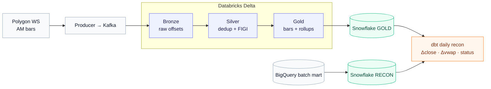

# Market Streaming Pipeline

End-to-end real-time market data lakehouse: **Polygon.io WebSocket → Kafka → Spark Structured Streaming → Delta Lake medallion → Snowflake**, with dbt reconciliation against a [companion batch pipeline](https://github.com/athapar/financial-data-pipeline-project). Designed for exactly-once delivery, idempotent writes, and a clean audit trail from raw event to analytical table.

**Live dashboard:** _(deployed via Streamlit Community Cloud — see [`dashboard/README.md`](./dashboard/README.md))_

## Architecture



## Tech Stack

`Python 3.11` · `Polygon.io WebSocket` · `Confluent Kafka` · `Apache Spark Structured Streaming` · `Databricks` · `Delta Lake (Unity Catalog)` · `Snowflake` · `dbt` · `BigQuery` (fundamentals/dividends/prices bridge)

## Engineering Highlights

| Problem | Solution |
|---|---|
| **Exactly-once across Kafka and Delta** | Spark checkpoints commit Kafka offsets atomically with each Delta write; downstream MERGE absorbs any replay from the last committed offset. |
| **Within-batch duplicates from producer retries** | `ROW_NUMBER() OVER (PARTITION BY symbol, window_start ORDER BY ingest_timestamp DESC)` dedup *before* the Silver MERGE — no full table scan. |
| **Snowflake `TIMESTAMP_NTZ` rejected as `NUMBER(38,0)`** | Traced to Arrow staging Parquet as `int64` micros. Replaced `write_pandas` with `cursor.executemany()` on native `datetime` objects — bypassed Arrow entirely. |
| **Producer durability without a secondary broker** | Date-partitioned NDJSON spillover on Kafka failure + gap log (disconnect/reconnect with reason) + replay script that re-publishes through the same code path. |
| **Late-arriving bars distorting daily rollup** | Gold `foreachBatch` re-aggregates each affected date from the full Silver snapshot using `min_by` / `max_by` over `window_start` — late corrections are deterministic. |
| **Identity stability across ticker renames** (FB → META) | `composite_figi` from the batch SCD2 security master is the join key downstream of Silver, broadcast-joined from a daily Parquet seed. |
| **Streaming vs. batch reconciliation** | dbt mart joins streaming Gold daily rollup against batch BigQuery prices on `(composite_figi, date)`, with a `recon_status` taxonomy that distinguishes genuine deltas from structurally expected ones (`PARTIAL_SESSION`). |
| **Live-priced valuation without recomputing the whole pipeline** | TTM fundamentals are computed in batch; the streaming dbt layer rescales price-derived ratios (P/E, P/B, P/S, P/FCF, market cap) by `live_close / batch_close`. Profitability and balance-sheet ratios pass through. A `pricing_status` flag distinguishes `OK` / `STALE_STREAMING` / `MISSING_STREAMING`. |
| **Databricks Serverless trigger limitation** | `trigger(availableNow=True)` across all three streaming layers — processes accumulated changes and exits cleanly; widget-configurable to `processingTime` on Classic clusters. |

## Operating Snapshot

| Metric | Value |
|---|---|
| Tracked symbols | 104 — S&P 100 + TSLA + SPY / QQQ / IWM / DIA |
| Real-time channels | AM (minute aggregates, all 104) · T (trades, all 104) · Q (NBBO quotes, 20 high-liquidity) |
| Delta Lake layers | Bronze · Silver (AM, trades, quotes) · Gold (minute bars, daily rollup, trades, quote stats) |
| Snowflake schemas | GOLD · RECON · OPS |
| dbt models | staging · intermediate · marts (recon · analytics · observability · fundamentals) |
| Test coverage | 46 unit tests — transforms, dedup, parse, spillover, config |
| CI | GitHub Actions — pytest matrix (3.11, 3.12) · ruff · dbt parse |

*Throughput, latency p50/p95/p99, and reconciliation deltas are populated from the next full-session market-hours run.*

## Repository

```
src/market_streaming/
├── producer/          polygon_ws · kafka_sink · spillover · envelope · metrics
├── bronze/transforms  Kafka → raw Delta (append-only, offset audit)
├── silver/transforms  parse · dedup · FIGI join · MERGE  (AM, trades, quotes)
├── gold/transforms    minute bars · daily rollup · gold trades · quote stats
├── sync/snowflake_writer    Gold Delta → Snowflake (executemany)
└── seed_security_master     BigQuery SCD2 → Parquet FIGI seed
notebooks/             bronze · silver (am/trades/quotes) · gold (am/trades/quotes)
                       snowflake_sync · run_pipeline · bronze_validate (Databricks)
scripts/
├── bq_to_snowflake_batch          BQ daily prices → RECON.BATCH_DAILY_PRICES
├── bq_to_snowflake_fundamentals   BQ valuation / factor scores / overview → RECON
├── bq_to_snowflake_dividends      BQ TTM dividend yield → RECON.DIVIDEND_YIELD
├── bq_to_snowflake_returns        BQ daily returns + rolling vol → RECON.BATCH_DAILY_RETURNS
├── check_data_quality             post-pipeline quality gate + Slack alert
├── create_kafka_topics            one-time Confluent topic provisioning
└── replay_spillover               re-publish undelivered envelopes from NDJSON
warehouse/             dbt project — staging · intermediate · marts
└── models/marts/      recon · analytics · observability · fundamentals
tests/                 46 unit tests — config · spillover · transforms
```

## Quick Start

```bash
pip install -e ".[producer,recon]"

# 1. Seed the security master (BigQuery → Parquet)
python -m market_streaming.seed_security_master

# 2. Run the producer (market hours; --dry-run skips Kafka)
python -m market_streaming.producer.main

# 3. In Databricks, run notebooks in order (or just run_pipeline.py orchestrator):
#    bronze_ingest → silver_ingest (am / trades / quotes)
#                  → gold_ingest   (am / trades / quotes)
#                  → snowflake_sync

# 4. After market close, bridge the batch pipeline
python scripts/bq_to_snowflake_batch.py --date YYYY-MM-DD
python scripts/bq_to_snowflake_returns.py             # daily (returns + rolling vol)
python scripts/bq_to_snowflake_fundamentals.py        # quarterly + as-needed
python scripts/bq_to_snowflake_dividends.py           # as-needed (after ex-div events)

# 5. Reconcile + build analytics marts
cd warehouse && dbt run && dbt test
```

Secrets are read from a `.env` (local) and a Databricks secret scope (`market-streaming`). See `profiles.example.yml` and `notebooks/snowflake_sync.py` for the full variable list.

## Snowflake Objects

```
MARKET_STREAMING
├── GOLD                          synced from Databricks Delta
│   ├── GOLD_MINUTE_BARS          PK (composite_figi, window_start)
│   ├── GOLD_DAILY_ROLLUP         PK (composite_figi, event_date)
│   ├── GOLD_TRADES               PK (composite_figi, trade_id)
│   └── GOLD_QUOTE_STATS          PK (composite_figi, window_start)
├── RECON                         bridged from BigQuery batch pipeline
│   ├── BATCH_DAILY_PRICES        PK (composite_figi, price_date)   -- split-adjusted OHLCV
│   ├── BATCH_DAILY_RETURNS       PK (composite_figi, price_date)   -- returns + 20/60-day vol
│   ├── COMPANY_OVERVIEW          PK (composite_figi)               -- sector, market cap
│   ├── FUNDAMENTALS_VALUATION    PK (composite_figi)               -- TTM P/E, P/B, margins
│   ├── FUNDAMENTALS_FACTOR_SCORES PK (composite_figi)              -- value/growth/quality
│   └── DIVIDEND_YIELD            PK (composite_figi, ex_dividend_date)
└── OPS                           pipeline observability
    └── PIPELINE_BATCH_METRICS    rows_in/out · duration_ms · status per layer batch

dbt output schemas
├── staging        stg_streaming__*  ·  stg_batch__*
├── intermediate   int_recon__daily_aligned  ·  int_fundamentals__live_priced  ·  int_*returns
└── marts
    ├── recon            mart_recon__daily_delta            (Δclose · Δvwap · recon_status)
    │                    mart_recon__returns_delta          (streaming vs batch daily return)
    ├── analytics        mart_analytics__daily_stats        (realized vol, dollar volume, VWAP dev)
    │                    mart_analytics__rolling_risk        (β · α · Sharpe vs SPY, 20-day)
    │                    mart_analytics__volume_profile      (intraday volume by 30-min bucket)
    │                    mart_analytics__unusual_activity    (z-score flagging)
    │                    mart_analytics__correlation_matrix  (pairwise return correlations)
    │                    mart_analytics__microstructure_daily
    │                    mart_analytics__spread_profile      (intraday U-curve)
    │                    mart_analytics__trade_size_distribution
    ├── observability    mart_ops__pipeline_health · mart_ops__data_quality
    └── fundamentals     mart_fundamentals__valuation_live   (P/E re-priced w/ live close)
                         mart_fundamentals__factor_scores   (enriched w/ sector)
                         mart_fundamentals__dividend_yield  (enriched w/ live yield estimate)
```

## Relation to the Batch Pipeline

This project extends the [batch financial data pipeline](https://github.com/athapar/financial-data-pipeline-project), bridging four classes of batch output into the streaming warehouse:

| Batch output (BigQuery) | Bridged to Snowflake | Used by |
|---|---|---|
| `int_security_master_scd2` | local Parquet seed | Silver FIGI broadcast join |
| `fct_daily_ohlcv` | `RECON.BATCH_DAILY_PRICES` | `mart_recon__daily_delta` |
| `mart_fundamentals_valuation` · `mart_fundamentals_factor_scores` · `stg_company_overview` | `RECON.FUNDAMENTALS_*` · `RECON.COMPANY_OVERVIEW` | `mart_fundamentals__valuation_live`, `__factor_scores` |
| `mart_dividend_yield` | `RECON.DIVIDEND_YIELD` | `mart_fundamentals__dividend_yield` |
| `mart_daily_returns` | `RECON.BATCH_DAILY_RETURNS` | `mart_recon__returns_delta` |

`composite_figi` is the cross-pipeline identity key throughout, so reconciliation and live-priced valuation survive ticker renames (FB → META) without code changes.
